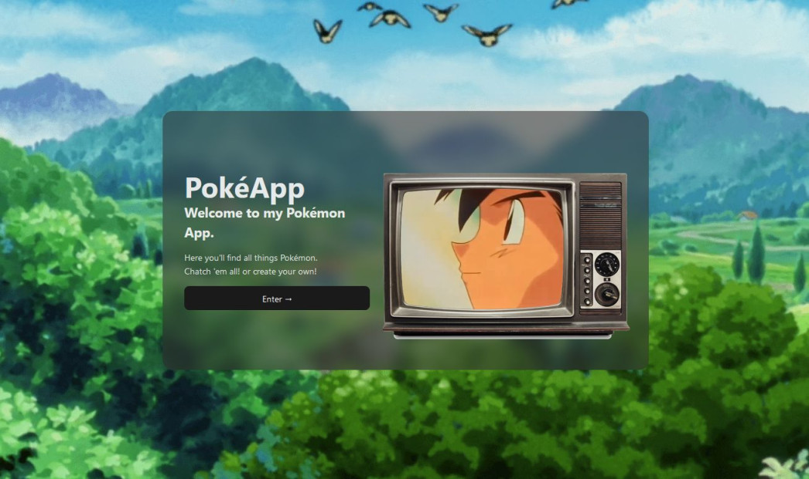
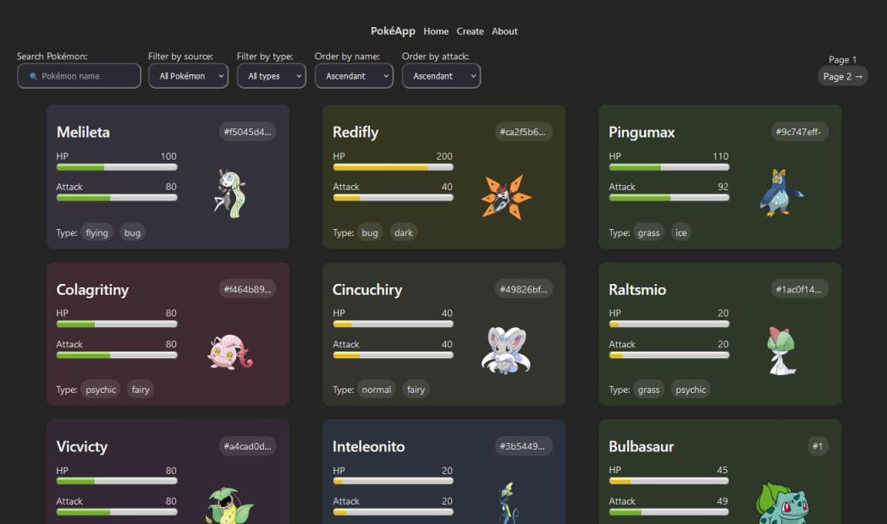
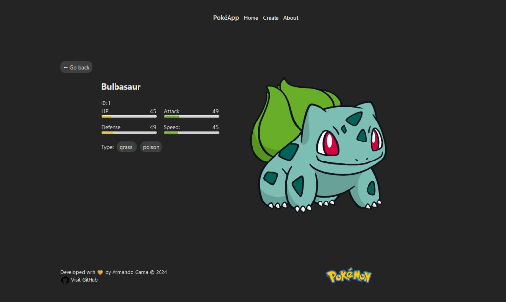

# **Pokémon App**

Welcome to the **Pokémon App**! This application allows you to explore and interact with data from the PokeAPI. You can view detailed information about Pokémon and even create your own unique Pokémon through the app's user-friendly interface.

---

## **Features**

- 🕵️‍♀️ **Explore Pokémon**: Browse through all the Pokémon retrieved from the PokeAPI.
- ✨ **Create Your Own Pokémon**: Add your custom Pokémon with the form provided.
- 🚀 **Seamless Frontend and Backend Integration**: Built with modern web technologies for a smooth user experience.

---

## **Technologies Used**

### **Frontend**

- **React + Vite**
- **CSS Modules**

### **Backend**

- **Node.js**
- **Sequelize ORM**
- **PostgreSQL**

---

## **Setup and Installation**

Follow the steps below to get the app up and running on your local environment.

### **Backend Setup**

1. Navigate to the `/api` directory:

```bash
cd api/
```

2. Install dependencies:

```bash
npm install
```

3. Create a `.env` file in the `/api` directory and add the following environment variables:

```JS
SERVER_PORT=3001
```

4. Start the backend server:

```bash
npm run start
```

### **Frontend Setup**

1.  Navigate to the `/client` directory:

```bash
cd client/
```

2. Install dependencies:

```bash
npm install
```

3. Start the frontend development server:

```bash
npm run dev
```

---

## **Running App**




![frontend app pokeapp screenshot][def]

[def]: client/src/assets//pokeapp-screenshot-4.jpg

## **Contact**

If you have any questions, suggestions, or feedback, feel free to reach out via:

📧 Email: armandopinedag@outlook.com

Happy coding! 🎉
